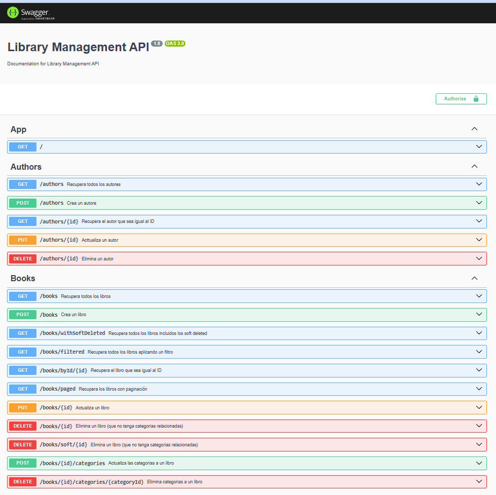
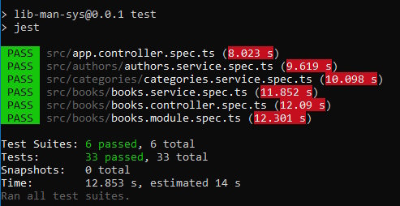
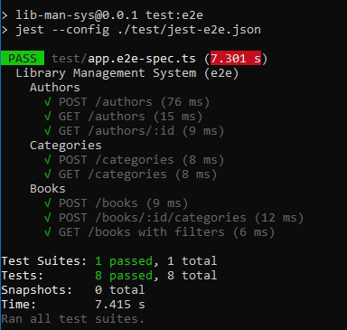
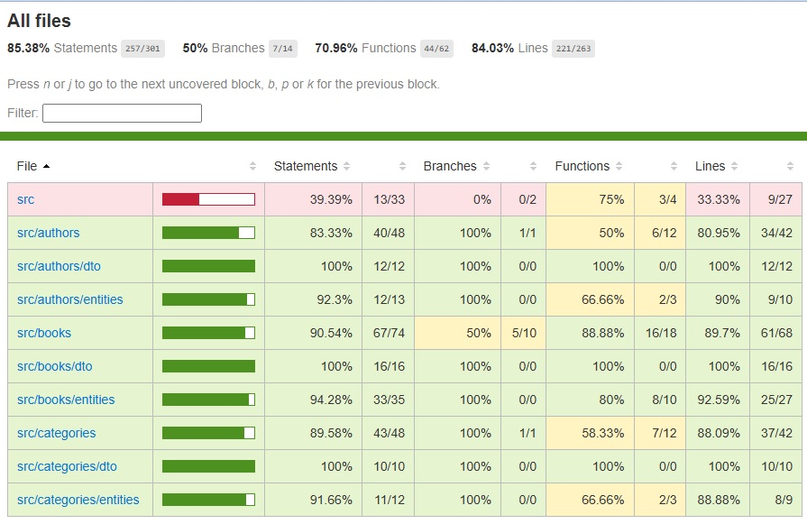
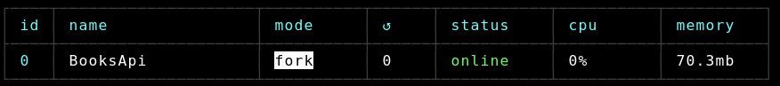
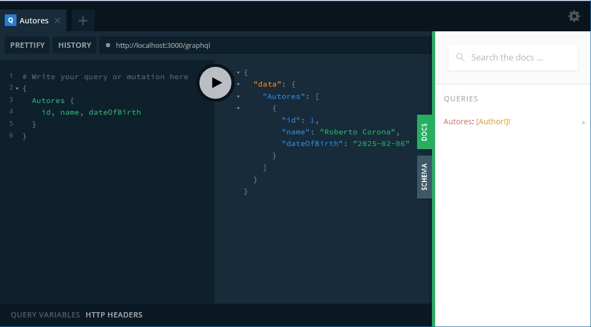
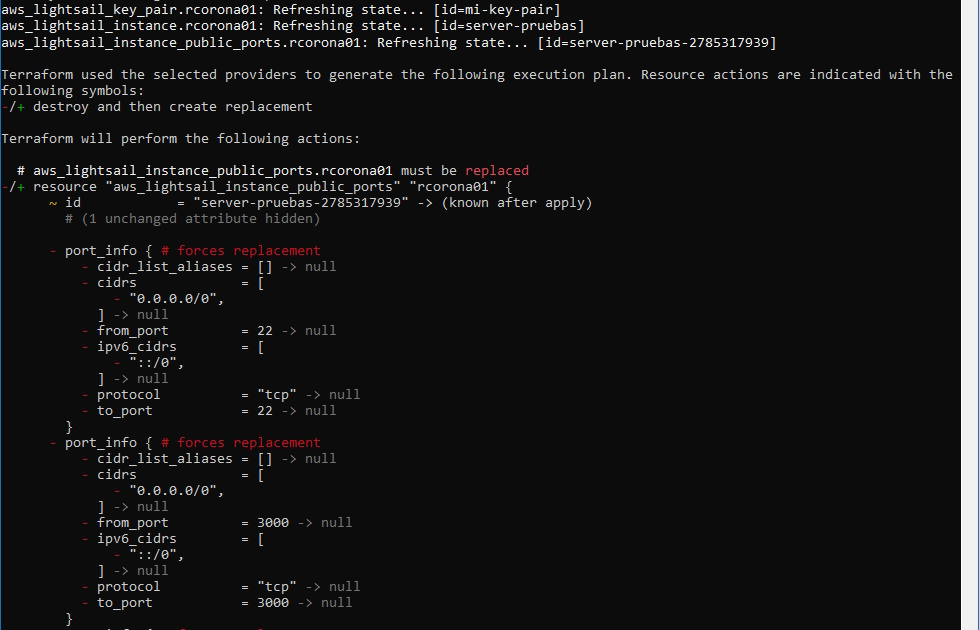

## Descripción

El repositoro actual continen una API web RESTful para un sistema de gestión de bibliotecas que proporciona operaciones CRUD y relaciones entre las siguientes entidades:

Libros: con una o más categorías.\
Autores: administra los detalles del autor, y cada libro se vinculará a un autor válido.\
Categorías: organiza los libros en múltiples categorías.

Incluyendo (extra bonus):\
**Relación de varios a varios**:\
Implementación de una tabla de unión BookCategory.\
**Búsqueda y filtrado**:\
Una función de búsqueda avanzada para libros por múltiples criterios (por ejemplo, autor, categoría, etc).\
**Paginación**:\
Paginación para los libros.\
**Eliminaciones temporales**:\
Permite eliminaciones temporales de libros y categorías para conservar datos históricos.\
**Implementación**:\
E Implementación en una plataforma como AWS para demostración.\
**GraphQL**\
Una breve demostración de adición de funcionalidad a las intefaces ya creadas.\
**Terraform**\
Una breve demostración de la creación de la infraestructura como codigo en AWS.


SWAGGER:
Soporte para Swagger para que se pueda probar las APIs parametros.




## Demo

Para REST:
http://3.146.178.27:3000/api


## Instalación

Requiere Node 20.11 o posterior (recomendable 23)

```bash
$ npm install
```

## Compila y ejecuta el proyecto

```bash
# development
$ npm run start

# watch mode
$ npm run start:dev

# production mode
$ npm run start:prod
```

## Ejecuta las pruebas unitarias, de integración y de covertura

```bash
# unit tests
$ npm run test

# e2e tests
$ npm run test:e2e

# test coverage
$ npm run test:cov
```

Pruebas unitarias:




Pruebas de integración:



Pruebas de covertura:




## Despliegue

```bash
$ npm run build
$ npm run start:prod
```

Ejecución en la nube:




## Extra Extra Bonus

GRAPHQL:
Pequeña funcionalidad para graphql para que se pueda personalizar las consultas y columnas, este tipo de consulta se agrega en automatico agregando una simple NOTATION a la interface.

Para acceder a la **pequeña demo** de GraphQL:
http://3.146.178.27:3000/graphql



Terraform:
Pequeña demostración de creación de infraestructura como codigo.




## Contribución

Las contribuciones son bienvenidas. Si deseas contribuir, por favor sigue estos pasos:

1. Haz un fork del repositorio.
2. Crea una nueva rama (`git checkout -b feature/nueva-funcionalidad`).
3. Realiza tus cambios y haz commit (`git commit -am 'Añade nueva funcionalidad'`).
4. Haz push a la rama (`git push origin feature/nueva-funcionalidad`).
5. Abre un Pull Request.

## Licencia

Este proyecto está licenciado bajo la licencia Apache 2.0. Consulta el archivo [LICENSE](LICENSE) para más detalles.

## Créditos

- **Roberto Corona** - Desarrollador principal.

## Contacto 

Si tienes alguna pregunta o necesitas ayuda, no dudes en contactarme:

- **Email**: roco170@gmail.com
